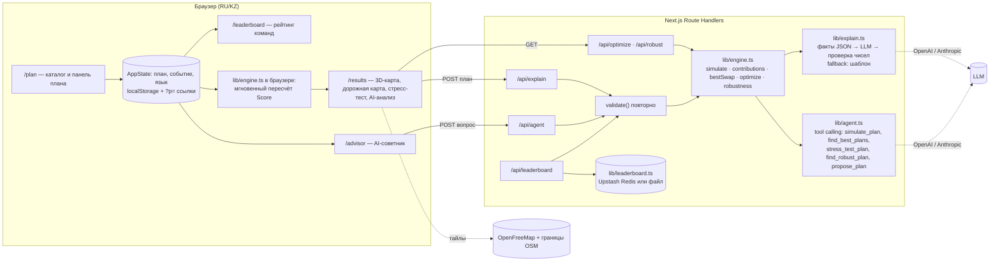

# Аким на 5 часов — AI-симулятор управления городом

HackAlem AI 2026 · Спец-трек Astana Innovations · команда **Onix**

**Команда:** Amir Kapasov, Abraimov Yeskendir

**Живая версия:** https://hack-b5a370cf-onix.vercel.app · Сценарий демо и ответы на вопросы жюри: [docs/DEMO.md](docs/DEMO.md) · Полный контекст проекта для разработчиков: [docs/HANDOFF.md](docs/HANDOFF.md)

---

## 1. Название проекта

**«Аким на 5 часов»** — веб-симулятор, в котором пользователь распределяет бюджет Астаны на пять управленческих решений и получает **Astana Quality of Life Score** с объяснением от AI.

## 2. Краткое описание

**Проблема.** Городской бюджет нужно разложить по транспорту, экологии, соцсфере, безопасности и сервисам, и последствия каждого решения видны только через годы. Управленцу и аналитику нужен инструмент, где можно быстро сравнить сценарии, увидеть компромиссы и проверить план на прочность.

**Решение.** Симулятор с единым бюджетом 100 у.е., каталогом из 14 мер и пятью районами города. Детерминированный движок считает Score по формуле технического задания, а AI объясняет результат, советует, что изменить, и находит план, который выдерживает городские кризисы. Ключевой принцип: **числа считает движок, AI только объясняет, и каждое число в его ответе сверяется с расчётом** (требование ТЗ: «LLM числа не считает и не придумывает»).

**Для кого.** Городские управленцы и аналитики акимата, а также любой пользователь симулятора, включая жюри и жителей.

## 3. Что реализовано

Обязательные требования кейса:

| Требование ТЗ | Реализация |
|---|---|
| Единый виртуальный бюджет для всех пользователей | 100 у.е., данные одинаковы для всех (`lib/data.ts`) |
| Решения по 5 направлениям | Каталог 14 мер по 5 направлениям, ровно 5 решений |
| Автоматический контроль превышения бюджета | Валидатор блокирует выбор с указанием причины; сервер проверяет план повторно |
| AI-анализ принятых решений | Анализ через LLM с проверкой чисел; без ключа — шаблонный аналитик из тех же фактов |
| Расчёт Astana Quality of Life Score | Формула ТЗ в `lib/engine.ts`, контрольные значения покрыты тестами |
| Объяснение сильных сторон, рисков и последствий | Разделы: сильные стороны, риски и последствия, компромиссы, рекомендации |

Дополнительно реализовано:

- **Реальная 3D-карта Астаны** (MapLibre GL): границы пяти районов из OpenStreetMap, высота района равна баллу или выбранному показателю, анимация при изменении плана; запасной режим «Схема» на чистом SVG без сети.
- **Дорожная карта на 2 года**: кнопка «▶ Проиграть 2 года» показывает Score по кварталам и момент включения каждой меры (лаг).
- **Стресс-тест и устойчивый план**: план прогоняется через 6 сценариев (без события и 5 городских событий); поиск максиминного плана, выполнимого при любом урезании бюджета.
- **5 городских событий** (авария теплосети, урезание трансферта, смог, новый ЖК, паводок): ухудшают показатели района и/или сокращают бюджет.
- **Поиск глобального оптимума** полным перебором всех допустимых планов (~700 тыс.) и **лучшая одиночная замена** меры.
- **AI-советник (агент)**: отвечает на вопросы вида «подними Нуру в бюджете 90», сам вызывает инструменты движка (симуляция, перебор с ограничениями, стресс-тест, устойчивый план), показывает каждый шаг и предлагает план, который применяется одной кнопкой.
- **Общий рейтинг команд** на сервере: планы без события, Score и худший случай считает сервер, одна команда — одна строка.
- **Отчёт для печати в PDF** (`/report`): план, вклад мер, графики, AI-разбор.
- **Два языка интерфейса** — русский и казахский, включая названия районов, мер, событий и ошибки валидатора; AI отвечает на выбранном языке.
- Тёмная тема, мобильная навигация, ссылки на план (`?p=...`), сравнение сохранённых сценариев.

## 4. Как работает решение

1. **Вход.** Пользователь на странице «План» выбирает 5 мер из каталога, для районных мер указывает район одним кликом. При желании включает городское событие (стресс-тест).
2. **Проверка правил.** Движок в браузере мгновенно проверяет бюджет (≤ 100), число решений (ровно 5), лимит по направлениям (не более 2), несовместимости (M1/M3; M4+M7 и M5+M13 в одном районе). Недопустимые варианты блокируются с объяснением.
3. **Расчёт.** Для каждого района и показателя считается новое значение с учётом лага мер и синергий, затем балл района, средний по городу и итоговый Score. Всё пересчитывается при каждом клике.
4. **Результат.** На странице «Результаты»: Score с дельтой к стартовому 52.56, 3D-карта, дорожная карта по кварталам, стресс-тест по 6 сценариям, графики «до/после» и вклад мер, тепловая карта показателей.
5. **AI.** По кнопке «AI-анализ» сервер повторно валидирует план, собирает факты расчёта в JSON и отправляет их LLM. Ответ (резюме, сильные стороны, риски, компромиссы, рекомендации) проверяется: числа сверяются с расчётом, при расхождении показывается проверенный шаблон. AI-советник на странице «Советник» ведёт диалог и вызывает инструменты движка.
6. **Выход.** Отчёт для печати в PDF, ссылка на план, отправка в общий рейтинг команд.

## 5. Технологии

- **Языки и фреймворки:** TypeScript, Next.js 16 (App Router, Route Handlers; production-сборка через webpack), React 19, Tailwind CSS 4.
- **Карта:** MapLibre GL JS 6 (BSD-3-Clause), границы районов из OpenStreetMap (ODbL), подложка OpenFreeMap (без токенов).
- **AI-модели и API:** OpenAI Chat Completions (по умолчанию `gpt-4.1-mini`) и Anthropic Messages API (по умолчанию `claude-sonnet-5`); вызываются напрямую через `fetch`, без SDK. Провайдер выбирается переменной `LLM_PROVIDER`, иначе Anthropic при наличии ключа, иначе OpenAI. Путь через Anthropic покрыт тестом с подменой сети, но на живом ключе не проверялся.
- **Хранилище рейтинга:** Upstash Redis (REST) при заданных переменных; без него — файл `data/leaderboard.json` (локально) или временный файл инстанса (демо-режим на Vercel).
- **Тесты и качество:** нативный `node --test` (45 тестов), ESLint, TypeScript.
- **Хостинг:** Vercel.

## 6. Архитектура проекта



Основные компоненты:

| Файл | Назначение |
|---|---|
| `lib/data.ts` | Датасет ТЗ: 5 районов × 10 показателей, веса, 14 мер, синергии, несовместимости, правила, 5 событий |
| `lib/engine.ts` | Движок: валидация с кодами ошибок, расчёт Score, вклад мер, лучшая замена, траектория по кварталам, стресс-тест, быстрый перебор планов, оптимум и устойчивый план, санитизация входа |
| `lib/explain.ts` | AI-анализ: факты для LLM, вызов провайдера, проверка чисел, шаблонный аналитик без ключа |
| `lib/agent.ts` | AI-советник: цикл tool calling (до 6 шагов) через OpenAI или Anthropic; лучший найденный план прикрепляется как предложение |
| `lib/llm.ts` | Выбор провайдера и безопасные для клиента коды ошибок |
| `lib/ai-rate-limit.ts`, `lib/leaderboard-rate-limit.ts`, `lib/request-json.ts` | Лимиты запросов к платным AI-маршрутам и рейтингу (Redis или память процесса), ограничение размера JSON-тела (32 КБ) |
| `lib/leaderboard.ts`, `lib/upstash.ts` | Общий рейтинг: Upstash Redis REST или локальный файл; атомарная запись; одна команда — одна строка, запись защищена токеном браузера |
| `lib/i18n.ts` | Словари RU/KZ для интерфейса и данных |
| `lib/plan-url.ts` | Кодирование плана в ссылку `?p=M7.nura,M12&e=heating` |
| `instrumentation.ts` | Прогрев кэша оптимума при старте локального сервера |
| `components/AppState.tsx`, `components/Shell.tsx`, `components/ui.tsx` | Общее состояние, каркас с навигацией и переключателем языка, UI-компоненты |
| `components/pages/*` | Страницы: главная, план, результаты, советник, рейтинг, методика |
| `components/RealMap3D.tsx`, `components/CityMap3D.tsx` | Реальная карта на MapLibre и схематичная SVG-карта |
| `components/Timeline.tsx`, `StressTest.tsx`, `charts.tsx`, `Heatmap.tsx`, `Advisor.tsx`, `Report.tsx` | Дорожная карта, стресс-тест, графики, тепловая карта, чат советника, отчёт |
| `app/api/{explain,agent,optimize,robust,leaderboard,health}/route.ts` | Серверные маршруты |
| `public/data/astana-districts.geojson` | Границы районов Астаны из OpenStreetMap |
| `lib/*.test.ts` | 45 автотестов |

Движок работает и в браузере (мгновенный отклик), и на сервере (повторная проверка перед AI и записью в рейтинг). Клиенту никогда не доверяют: вход санитизируется, план валидируется заново.

## 7. Установка и запуск

Требования: **Node.js ≥ 22.18** (в репозитории `.npmrc` с `engine-strict=true`; на более старом Node установка остановится с понятным сообщением), npm.

```bash
git clone https://github.com/BAITC-Hacks/hack-b5a370cf-onix.git
cd hack-b5a370cf-onix
npm install
npm run dev
```

Откройте http://localhost:3000. Проверка окружения: http://localhost:3000/api/health.

Production-сборка: `npm run build && npm start`. Полная проверка одной командой: `npm run check` (тесты → линтер → сборка → типы).

**Ключ LLM не обязателен.** Без ключа всё работает, AI-анализ собирает шаблонный аналитик, AI-советник сообщает, что ему нужен ключ. Для анализа через LLM:

```bash
cp .env.example .env.local
# впишите OPENAI_API_KEY=... (или ANTHROPIC_API_KEY=...)
```

| Переменная | Обязательна | По умолчанию | Назначение |
|---|---|---|---|
| `OPENAI_API_KEY` | нет | — | Анализ и советник через OpenAI |
| `OPENAI_MODEL` | нет | `gpt-4.1-mini` | Модель OpenAI |
| `OPENAI_BASE_URL` | нет | `https://api.openai.com/v1` | Любой OpenAI-совместимый endpoint |
| `ANTHROPIC_API_KEY` | нет | — | Анализ и советник через Claude |
| `ANTHROPIC_MODEL` | нет | `claude-sonnet-5` | Модель Claude |
| `LLM_PROVIDER` | нет | — | `openai` или `anthropic` — принудительный выбор при двух ключах |
| `UPSTASH_REDIS_REST_URL`, `UPSTASH_REDIS_REST_TOKEN` | нет | — | Постоянный общий рейтинг и лимиты запросов (нужны на Vercel для публичной эксплуатации) |
| `AKIM_DEMO_MODE` | нет | — | `1` — демо-режим на Vercel без Upstash: лимиты в памяти инстанса, рейтинг во временном файле |

Скрипты `predev` и `prebuild` копируют воркер MapLibre в `public/maplibre/` автоматически.

## 8. Как проверить решение

1. **Автотесты движка:** `npm test` → 45 из 45 passed (контрольные числа ТЗ, валидатор, события, устойчивость, санитизация входа, проверка чисел, цикл агента с подменой сети).
2. Откройте http://localhost:3000. Стартовый Score **52.56**. Переключатель РУС/ҚАЗ меняет язык интерфейса.
3. Нажмите **«Загрузить пример из ТЗ»** (M7, M8, M10 в Нуре, M12, M5 в Сарыарке). Ожидается **Score 56.54**, стоимость 95, в панели плана «Синергия M10+M12: B1 +2».
4. **Контроль правил:** попробуйте добавить 6-ю меру, третью меру одного направления или ЛРТ (M3) при выбранных полосах (M1). Кнопки районов станут неактивными, причина показывается во всплывающей подсказке.
5. **Результаты:** на 3D-карте районы имеют высоту по баллу. Нажмите **«▶ Проиграть 2 года»** — Score растёт по кварталам, диаграмма показывает, когда включается каждая мера.
6. **Стресс-тест:** блок показывает Score во всех 6 сценариях; для примера из ТЗ план невыполним при урезанном бюджете. **«Найти устойчивый план»** → план со стоимостью 83 и худшим случаем **55.69**. Раскройте «Лучшие планы и сравнение» → **«Найти оптимум»** → лучший план **57.24** (стоимость 98); в стресс-тесте он проваливается в 2 из 6 сценариев.
7. **AI-анализ:** нажмите «Проанализировать». С ключом появится ответ LLM с плашкой «Все числа сверены с движком»; без ключа — шаблонный анализ с пометкой.
8. **AI-советник** (нужен ключ): нажмите подсказку «Найди лучший план без ЛРТ и в бюджете 80». Агент вызовет перебор с ограничениями, покажет шаги и предложит план (Score 56.87, стоимость 72) с кнопкой «Применить».
9. **Городское событие:** выберите «Сокращение трансферта из республиканского бюджета» — бюджет станет 85, план за 95 станет невалидным с указанием причины. Выберите «Прорыв теплотрассы в Алматы» — ЖКХ Алматы упадёт ниже 40.
10. **Отчёт:** «Отчёт / PDF» открывает одностраничный отчёт; «Сохранить PDF / Печать» печатает его.
11. **Рейтинг:** на странице «План» без выбранного события нажмите «🏆 Отправить в рейтинг», введите название команды — сервер пересчитает Score и худший случай и покажет место. Откройте `/leaderboard` с другого устройства в той же сети — таблица общая.

Те же шаги можно повторить на живой версии https://hack-b5a370cf-onix.vercel.app.

## 9. Данные и интеграции

- **Датасет кейса** (районы, показатели, веса, меры, синергии, несовместимости, правила) — из технического задания Astana Innovations, перенесён в `lib/data.ts` без изменений; данные синтетические.
- **Границы районов Астаны** — OpenStreetMap (relations 3479876, 3482819, 3486954, 8593081, 20593940), выгружены через Nominatim и сохранены в `public/data/astana-districts.geojson`; работают без сети. Лицензия ODbL, атрибуция выводится на карте.
- **Подложка карты** — OpenFreeMap (стиль Liberty, данные OSM/OpenMapTiles), без токена; при отсутствии сети районы рисуются без подложки.
- **LLM** — OpenAI API или Anthropic API, только для текстовых объяснений и выбора инструментов агентом; персональные данные не передаются, в модель уходят только результаты расчёта и текст вопроса.
- **Upstash Redis** (опционально) — общий рейтинг и лимиты запросов между инстансами.

## 10. Ограничения

- Модель линейная и аддитивная, как задано в ТЗ: эффекты мер не зависят от исходного уровня показателя (кроме обрезки в диапазон 0–100).
- Данные синтетические и не отражают реальные показатели районов Астаны.
- AI-советник работает только при наличии ключа LLM. Путь через Anthropic написан по спецификации и покрыт тестом с подменой сети, но на живом ключе не проверялся; на хакатоне проверялся OpenAI.
- Шаблонный аналитик (без ключа) выдаёт текст только на русском; в интерфейсе это подписано.
- Рейтинг принимает только планы без события, чтобы у всех были одинаковые стартовые условия. Без Upstash рейтинг хранится в файле: локально — постоянно, на Vercel в демо-режиме — во временном файле инстанса, который может обнулиться при перезапуске.
- Лимиты запросов к AI-маршрутам и рейтингу без Redis считаются в памяти процесса, то есть не разделяются между инстансами.
- Полный перебор рассчитан на каталог до ~15–16 мер и 5 районов (0.3–0.6 с); для большего каталога потребуется branch-and-bound или ILP (функция перебора изолирована).
- GitHub Actions в организации хакатона были заблокированы на стороне GitHub, поэтому `.github/workflows/ci.yml` не запускался; проверки дублирует `npm run check`.
- Казахские тексты интерфейса не вычитывались носителем языка.

## 11. Deployed-версия

**https://hack-b5a370cf-onix.vercel.app** — production на Vercel. Симулятор, карта, оптимум, стресс-тест, AI-анализ, AI-советник и рейтинг работают (включён демо-режим `AKIM_DEMO_MODE=1` без Upstash: лимиты в памяти инстанса, рейтинг во временном файле).

---

## Приложение А. Модель расчёта (точно по ТЗ)

1. **Показатель после мер:** `I'_dk = clip(I_dk + Σ эффект_m,k × (8 − L_m)/8 + синергии, 0, 100)`. Горизонт 8 кварталов, лаг L срезает долю эффекта. Районная мера действует на выбранный район, городская на все 5.
2. **Балл района:** `D_d = Σ w_k × I'_dk`, веса T1 .10, T2 .10, E1 .09, E2 .11, S1 .11, S2 .11, B1 .09, B2 .09, C1 .10, C2 .10.
3. **Город:** `D_avg = Σ pop_d × D_d` (взвешивание по доле населения).
4. **Итог:** `Score = 0.7 × D_avg + 0.3 × min(D_d) − 1 × N_crit`, где `N_crit` — число пар «район × показатель» со значением строго < 40.
5. **Синергии** (M1+M2 → T1 +2, M10+M12 → B1 +2, M5+M6 → E2 +2) применяются в районе первой меры пары, лагом не масштабируются.

Дорожная карта по кварталам: к кварталу q мера с лагом L реализует долю `max(0, q − L)/8`; при q = 8 это совпадает с формулой ТЗ.

Стресс-тест: план прогоняется через сценарии «без события» и 5 событий; устойчивый план максимизирует худший Score среди планов, выполнимых при самом урезанном бюджете (максимин).

## Приложение Б. Роль AI и проверка достоверности

| Что делает AI | Как обеспечена достоверность |
|---|---|
| Объясняет итог: почему Score такой, какие меры дали больше всего | На вход подаётся только JSON с фактами из движка: дельты по районам и показателям, вклад каждой меры, критические значения, синергии |
| Показывает сильные стороны, риски, последствия, компромиссы | Промпт запрещает считать и вводить новые числа; числа ответа сверяются с фактами и каталогом, при расхождении показывается проверенный шаблон |
| Рекомендует улучшения | Замена и оптимум посчитаны движком (`bestSwap`, `optimize`), LLM только формулирует их |
| Агент-советник отвечает на вопросы «как поднять Нуру в бюджете 90?», «выдержит ли план кризисы?» | LLM выбирает инструменты и ограничения, считает движок; предложенный план повторно проходит валидатор |

## Приложение В. Как подключить реальные данные

| Что менять | Где | Что произойдёт |
|---|---|---|
| Показатели районов, доли населения, профили | `DISTRICTS` в `lib/data.ts` (+ переводы в `lib/i18n.ts`) | Карта, графики, стартовый Score и оптимум пересчитаются автоматически |
| Меры: стоимость, лаг, эффекты, направление, масштаб | `MEASURES` в `lib/data.ts` | Каталог, перебор, советник и стресс-тест используют новый каталог; тесты на контрольные числа ТЗ нужно обновить |
| Синергии и несовместимости | `SYNERGIES`, `CONFLICTS` | Валидатор и подсказки обновятся |
| Бюджет, число решений, порог критичности, веса | `RULES`, `INDICATOR_INFO` | Формула читается из этих констант |
| Городские события | `EVENTS` | Стресс-тест и устойчивый план используют новый набор |
| Границы районов | `public/data/astana-districts.geojson` | Для другого города — выгрузить границы через Nominatim |

## Приложение Г. Потенциал развития

- Реальные данные акимата вместо синтетики без изменения логики.
- Планирование перекрытий и ремонтов дорог на графе дорог из OSM и данных трафика.
- Многолетнее планирование с переходящими эффектами мер.
- Открытая витрина сценариев для жителей и калибровка эффектов мер по фактической динамике показателей.

## Сторонние компоненты (п. 5.4.4 Положения)

| Компонент | Лицензия | Назначение |
|---|---|---|
| Next.js, React, React DOM | MIT | Веб-фреймворк |
| MapLibre GL JS | BSD-3-Clause | 3D-карта |
| Tailwind CSS | MIT | Стили |
| TypeScript, ESLint, eslint-config-next | Apache-2.0 / MIT | Инструменты разработки |
| OpenStreetMap (границы районов) | ODbL | Данные карты, атрибуция на карте |
| OpenFreeMap (подложка) | бесплатный сервис, данные OSM/OpenMapTiles | Тайлы подложки |
| OpenAI API / Anthropic API | коммерческие API | Опциональная генерация текста объяснений |
| Upstash Redis | коммерческий сервис, бесплатный тариф | Опциональное хранилище рейтинга и лимитов |

Каркас проекта создан через `create-next-app`. Логика симулятора, AI-слой и интерфейс написаны во время соревновательной части с помощью AI-инструментов разработки (Claude Code, Codex), что разрешено п. 5.4.12 Положения.
