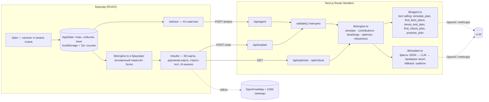

# Аким на 5 часов — AI-симулятор управления городом

**HackAlem AI · Спец-трек Astana Innovations · команда Onix**

Полная проверка одной командой: `npm run check` (тесты → линтер → production-сборка → типы). Тот же набор описан в `.github/workflows/ci.yml`; GitHub Actions в организации хакатона в день соревнования были отключены на стороне GitHub (billing lock), поэтому проверки продублированы локальной командой.

Веб-симулятор, в котором пользователь распределяет единый бюджет (100 у.е.) Астаны на **ровно 5 управленческих решений** по транспорту, экологии, соцсфере, безопасности и городским сервисам и сразу видит **Astana Quality of Life Score**, изменения показателей каждого района и **AI-объяснение**: сильные стороны, риски, компромиссы и конкретные рекомендации.

Главный принцип: **числа считает детерминированный движок, AI только объясняет**. LLM получает готовый результат расчёта и не может «придумать» Score. Каждое число в ответе LLM автоматически сверяется с расчётом.

---

**Страницы:** `/` главная (обзор города) · `/plan` каталог и панель плана · `/results` 3D-карта, дорожная карта, стресс-тест, AI-анализ, оптимум, сравнение · `/advisor` AI-советник-агент · `/leaderboard` общий рейтинг команд · `/method` методика · `/report` отчёт для печати. Состояние плана общее для всех страниц и хранится в браузере. **Язык интерфейса: русский и казахский** (переключатель РУС/ҚАЗ в шапке). AI-анализ и советник отвечают на выбранном языке.

## Быстрый старт (одна команда)

Требования: **Node.js ≥ 22.18** (проверено на Node 24.14, npm 11). В репозитории есть `.npmrc` с `engine-strict=true`: на более старом Node `npm install` остановится с понятным сообщением (тесты используют нативный запуск `.ts` в Node).

```bash
npm install && npm run dev
```

Откройте http://localhost:3000. Проверка окружения одной строкой: http://localhost:3000/api/health (движок, наличие ключей LLM, доступность подложки карты).

Production-сборка: `npm install && npm run build && npm start`.

**Ключ LLM не обязателен.** Без ключа всё работает, а AI-анализ собирается встроенным шаблонным аналитиком из тех же данных. Для анализа через LLM скопируйте `.env.example` в `.env.local` и укажите один ключ:

```bash
cp .env.example .env.local
# ANTHROPIC_API_KEY=...   (или OPENAI_API_KEY=...)
```

| Переменная | Обязательна | По умолчанию | Назначение |
|---|---|---|---|
| `ANTHROPIC_API_KEY` | нет | — | Анализ и советник через Claude (приоритетный провайдер, если задан) |
| `ANTHROPIC_MODEL` | нет | `claude-sonnet-5` | Модель Claude |
| `OPENAI_API_KEY` | нет | — | Анализ и советник через OpenAI |
| `LLM_PROVIDER` | нет | — | `openai` или `anthropic`: принудительный выбор провайдера при двух ключах |
| `OPENAI_MODEL` | нет | `gpt-4.1-mini` | Модель OpenAI |
| `OPENAI_BASE_URL` | нет | `https://api.openai.com/v1` | Любой OpenAI-совместимый endpoint (в том числе NVIDIA NIM или локальная модель) |

Если LLM недоступен (нет ключа, ошибка сети, таймаут 25 с, битый JSON), пользователь получает шаблонный анализ и видит пометку о причине. Приложение не падает.

## Как проверить основной сценарий (≈2 минуты)

1. **Автотесты движка:** `npm test`. Должно быть 18 из 18 passed: база 52.56, пример из ТЗ 56.54, валидатор, оптимизатор.
2. Откройте http://localhost:3000. Стартовый Score на главной **52.56**. Переключатель РУС/ҚАЗ меняет язык всего интерфейса.
3. Нажмите «Загрузить пример из ТЗ» или соберите его на странице «План», кликая по району в карточке меры:
   M7 → Нура, M8 → Нура, M10 → Нура, M12 (город), M5 → Сарыарка.
   Ожидается **Score 56.54**, стоимость 95, в панели плана появится «Синергия M10+M12: B1 +2».
4. **Контроль бюджета:** попробуйте добавить меру, которая выведет сумму за 100. Кнопки районов (и «+ Весь город») в карточке меры становятся неактивными, причина показывается во всплывающей подсказке при наведении. Так же блокируются 3-я мера одного направления, несовместимые пары (M1+M3, M4+M7 в одном районе, M5+M13 в одном районе) и 6-е решение.
5. Нажмите **«Проанализировать»**. Появятся резюме, сильные стороны, риски, компромиссы и рекомендации, включая лучшую одиночную замену меры и сравнение с оптимумом.
6. Уберите M5 и добавьте M3 → Нура. Score изменится на **57.21**, в таблице районов видно, какие показатели сдвинулись.
7. На «Результатах» раскройте блок **«Лучшие планы и сравнение»** и нажмите **«Найти оптимум»**. Полный перебор ~700 тыс. допустимых наборов (доли секунды, кэш прогревается при старте) покажет топ-5; лучший набор даёт **57.24**. Кнопка «Применить» загружает его.
8. На странице «План» нажмите «В сравнение»: сценарий появится в таблице сравнения на «Результатах» (блок «Лучшие планы и сравнение», сортировка по Score).
9. **AI-советник** (нужен любой ключ LLM: `OPENAI_API_KEY` или `ANTHROPIC_API_KEY`): нажмите подсказку «Найди лучший план без ЛРТ и в бюджете 80». Агент сам вызовет перебор планов с ограничениями (без M3, бюджет ≤ 80), покажет шаги и предложит план (Score 56.87, стоимость 72). Кнопка «Применить» загружает его в симулятор.
10. **Отчёт:** в панели плана или в шапке «Результатов» нажмите «Отчёт / PDF». Откроется одностраничный отчёт-презентация решения с графиками и AI-разбором, кнопка «Сохранить PDF / Печать» печатает его.
11. **Дорожная карта:** на «Результатах» нажмите «▶ Проиграть 2 года». Score растёт 52.56 → 57.24 (для оптимального плана) по кварталам, карта и диаграмма мер меняются синхронно.
12. **Стресс-тест:** для оптимального плана блок «Стресс-тест плана» покажет «провал в 2 из 6 сценариев». «Найти устойчивый план» предложит план с худшим случаем 55.69, выполнимый во всех событиях. Советник отвечает на подсказку «Мой план выдержит сокращение бюджета? Что поменять?» инструментами stress_test_plan и find_robust_plan.
13. **Рейтинг команд:** на странице «План» нажмите «🏆 Отправить в рейтинг», введите название команды и отправьте. Сервер пересчитает Score и худший случай и покажет место. Откройте `/leaderboard` с другого устройства в той же сети — таблица общая.
14. **Городское событие:** выберите «Сокращение трансферта из республиканского бюджета». Бюджет станет 85, набор из шага 3 (стоимость 95) станет невалидным, валидатор покажет причину. Выберите «Прорыв теплотрассы в Алматы»: ЖКХ Алматы упадёт до 38 (ниже 40, штраф), и AI-анализ предложит заменить M5 на M14 (+1.44).

Сценарий демонстрации на 5 минут и ответы на вопросы жюри: [docs/DEMO.md](docs/DEMO.md). Полный контекст проекта для разработчиков и AI-агентов (ТЗ, архитектура, решения, правила): [docs/HANDOFF.md](docs/HANDOFF.md).

## Архитектура

```
┌──────────────────────────── Браузер ────────────────────────────┐
│ Страницы /plan /results /advisor /report (RU/KZ)                 │
│  каталог мер → выбор района → живой пересчёт Score и графиков    │
│  (движок работает прямо в браузере, отклик мгновенный)           │
└───────────────┬──────────────────────────────┬──────────────────┘
                │ POST /api/explain, /api/agent│ GET /api/optimize
┌───────────────▼──────────────────────────────▼──────────────────┐
│ Next.js Route Handlers (сервер)                                  │
│  1. повторная валидация набора (клиенту не доверяем)             │
│  2. lib/engine.ts: simulate + вклад мер + лучшая замена + оптимум│
│  3. lib/explain.ts: факты в JSON → LLM → проверка чисел          │
│  4. lib/agent.ts: LLM ⇄ инструменты движка (tool calling)        │
│     └─ fallback: детерминированный шаблонный аналитик            │
└──────────────────────────────────────────────────────────────────┘
```



| Файл | Что делает |
|---|---|
| `lib/data.ts` | Датасет из ТЗ 1:1: 5 районов × 10 показателей, веса, 14 мер, синергии, несовместимости, правила |
| `lib/engine.ts` | `validate()` с понятными причинами отказа, `simulate()` по формуле ТЗ, `contributions()` (вклад каждой меры методом leave-one-out), `bestSwap()`, `optimize()` (полный перебор) |
| `lib/explain.ts` | Сборка фактов для LLM, промпт, вызов Anthropic или OpenAI, парсинг JSON, проверка чисел, шаблонный fallback |
| `lib/engine.test.ts` | Проверочные сценарии из ТЗ (`node --test`) |
| `app/api/explain/route.ts` | AI-анализ валидного набора |
| `lib/agent.ts` | AI-советник: tool calling (OpenAI или Anthropic Messages API) поверх движка (simulate_plan, find_best_plans, stress_test_plan, find_robust_plan, propose_plan), до 6 шагов, проверка чисел в ответе |
| `lib/llm.ts` | Единый выбор провайдера (LLM_PROVIDER → Anthropic → OpenAI) и безопасные для клиента коды ошибок |
| `components/Timeline.tsx`, `components/StressTest.tsx` | Дорожная карта по кварталам и стресс-тест с устойчивым планом |
| `app/api/robust/route.ts` | Устойчивый (максиминный) план |
| `lib/leaderboard.ts`, `app/api/leaderboard/route.ts`, `components/pages/LeaderboardPage.tsx` | Общий рейтинг команд: хранилище `data/leaderboard.json` на сервере, сериализованная запись, одна команда — одна строка |
| `app/api/health/route.ts` | Проверка окружения: движок, активный LLM-провайдер, доступность подложки карты |
| `app/api/agent/route.ts` | Endpoint советника |
| `lib/i18n.ts` | Словари RU/KZ и перевод данных по id |
| `components/AppState.tsx` | Общее состояние (план, событие, язык) для всех страниц, localStorage и ссылки `?p=` |
| `components/Shell.tsx`, `components/pages/*` | Навигация и страницы: главная, план, результаты, советник, методика |
| `components/Advisor.tsx` | Чат советника с трассировкой шагов и кнопкой «Применить» |
| `components/Report.tsx`, `app/report/page.tsx` | Отчёт-презентация решения для печати в PDF |
| `components/RealMap3D.tsx` | Реальная 3D-карта: MapLibre GL + границы районов OSM + подложка OpenFreeMap (без токенов); без сети рисует районы на пустом фоне |
| `components/CityMap3D.tsx` | Схематичная 3D-карта на чистом SVG (запасной режим) |
| `public/data/astana-districts.geojson` | Границы районов Астаны (OSM relations 3479876, 3482819, 3486954, 8593081, 20593940), упрощены через Nominatim |
| `scripts/copy-maplibre.mjs` | Копирует воркер MapLibre в `public/` перед `dev`/`build` |
| `components/charts.tsx`, `components/Heatmap.tsx` | Графики: районы «до/после», вклад мер, тепловая карта |
| `app/api/optimize/route.ts` | Топ-5 наборов по полному перебору (результат кэшируется в памяти процесса) |

**Технологии:** Next.js 16 (App Router), React 19, TypeScript, Tailwind CSS 4, Node test runner. LLM вызывается через REST API напрямую `fetch`-ом, без SDK. Runtime-зависимости: next, react, react-dom, maplibre-gl.

## Модель расчёта (точно по ТЗ)

1. **Показатель после мер:** `I'_dk = clip(I_dk + Σ эффект_m,k × (8 − L_m)/8 + синергии, 0, 100)`. Горизонт 8 кварталов, лаг L срезает долю эффекта. Районная мера действует на выбранный район, городская на все 5.
2. **Балл района:** `D_d = Σ w_k × I'_dk`, веса T1 .10, T2 .10, E1 .09, E2 .11, S1 .11, S2 .11, B1 .09, B2 .09, C1 .10, C2 .10.
3. **Город:** `D_avg = Σ pop_d × D_d` (взвешивание по доле населения).
4. **Итог:** `Score = 0.7 × D_avg + 0.3 × min(D_d) − 1 × N_crit`, где `N_crit` — число пар «район × показатель» со значением строго < 40.
5. **Синергии** (M1+M2 → T1 +2, M10+M12 → B1 +2, M5+M6 → E2 +2) применяются в районе первой меры пары, лагом не масштабируются.

**Правила валидации:** бюджет ≤ 100; ровно 5 решений; без повторов; район обязателен для районных мер и запрещён для городских; не более 2 мер из одного направления; M1 и M3 несовместимы везде; M4+M7 и M5+M13 несовместимы в одном районе. Невалидный набор не получает Score, валидатор возвращает причину. Проверка идёт на клиенте (UI не даёт собрать такой набор) и повторно на сервере.

**Контрольные значения:** база 52.56 · пример ТЗ (M7, M8, M10 в Нуре + M12 + M5 в Сарыарке) = 56.54 · глобальный оптимум = 57.24 (M2 + M3/Нура + M8/Нура + M9/Нура + M14).

## Роль AI

| Что делает AI | Как обеспечена достоверность |
|---|---|
| Объясняет итог: почему Score такой, какие меры дали больше всего | На вход подаётся только JSON с фактами из движка: дельты по районам и показателям, вклад каждой меры (leave-one-out), критические значения, сработавшие синергии |
| Показывает сильные стороны, риски, последствия | Промпт запрещает считать и вводить новые числа |
| Описывает компромиссы: какие направления и районы остались без вложений | После ответа все числа > 10 сверяются с фактами. Несовпадения показываются красной плашкой «Числа не из расчёта» |
| Рекомендует улучшения: конкретную замену и сравнение с оптимумом | Замена и оптимум посчитаны движком (`bestSwap`, `optimize`), LLM только формулирует их |
| **Агент-советник** отвечает на вопросы вида «как поднять Нуру в бюджете 90?» и «что если убрать M8?» | LLM выбирает инструменты и ограничения, а считает движок. Предложенный план повторно проверяется валидатором, числа в ответе сверяются с результатами инструментов |

Шаблонный аналитик (без LLM) выдаёт тот же формат из тех же фактов по правилам. Поэтому решение проверяемо без личных аккаунтов и платных подписок (п. 5.6.6 Положения).

## Выполнение требований ТЗ

| Must have | Где реализовано |
|---|---|
| Единый виртуальный бюджет для всех | `RULES.budget = 100` в `lib/data.ts`, одинаковые исходные данные у всех пользователей |
| Решения по 5 направлениям | Каталог 14 мер, сгруппированный по направлениям; ровно 5 решений |
| Автоматический контроль превышения бюджета | `validate()` + блокировка выбора района/города в карточке меры с причиной в подсказке + повторная проверка на сервере |
| AI-анализ принятых решений | `/api/explain` → `lib/explain.ts` |
| Расчёт Astana Quality of Life Score | `simulate()` в `lib/engine.ts`, покрыт тестами |
| Сильные стороны, риски, последствия | Разделы анализа: сильные стороны, риски и последствия, компромиссы, рекомендации |

| Опционально | Статус |
|---|---|
| Сравнение результатов нескольких команд или сценариев | ✅ **Общий рейтинг команд** (`/leaderboard`): план отправляется на сервер, Score и худший случай по кризисам считает движок на сервере, таблица общая для всех устройств в сети (жюри может играть с телефонов). Плюс локальное сравнение сценариев «В сравнение» на «Результатах» |
| Визуализация изменений показателей районов | ✅ **Реальная 3D-карта Астаны** (MapLibre GL): настоящие границы 5 районов из OpenStreetMap (скачаны в `public/data/astana-districts.geojson`, работают без сети), подложка OpenFreeMap; высота и цвет района равны баллу или выбранному показателю, анимация при изменении плана. Запасной режим «Схема» (SVG-изометрия, реальное взаимное расположение районов и р. Есиль) работает без сети: пунктир «до мер», метки показателей < 40 |
| AI-рекомендации по улучшению сценария | ✅ Лучшая одиночная замена + разница с глобальным оптимумом |
| Поиск оптимального набора | ✅ Полный перебор всех допустимых наборов |
| **Дорожная карта на 2 года** | ✅ Кнопка «▶ Проиграть 2 года»: Score по кварталам 0…8 (меры включаются после лага и набирают по 1/8 за квартал; в 8-м квартале совпадает с формулой ТЗ (8 − L)/8), 3D-карта растёт синхронно, диаграмма показывает, какая мера когда заработала |
| **Стресс-тест и устойчивый план** | ✅ План прогоняется через все 6 сценариев (без события и 5 событий): Score в каждом, где план невыполним, худший случай. «Найти устойчивый план» перебирает все планы, выполнимые в любом урезанном бюджете, и максимизирует худший Score (максимин). Пример: глобальный оптимум 57.24 невыполним в 2 из 6 сценариев, а устойчивый план (M2, M4/Нура, M8/Нура, M9/Нура, M14; стоимость 83) выполним везде с худшим Score 55.69 |
| Агентный AI | ✅ AI-советник: цикл tool calling (simulate_plan, find_best_plans с ограничениями, stress_test_plan, find_robust_plan, propose_plan) через OpenAI или Anthropic; каждый шаг агента виден пользователю, предложенный план проходит валидатор |
| Двуязычный интерфейс RU/KZ | ✅ Весь интерфейс, названия районов, показателей, мер, событий и ошибки валидатора на двух языках (`lib/i18n.ts`); LLM отвечает на выбранном языке |
| Автоматическая генерация краткой презентации решения | ✅ `/report`: одностраничный отчёт (Score, 5 решений с вкладом, графики, AI-разбор, показатели районов), печать в PDF |
| Моделирование неожиданных городских событий с перераспределением бюджета | ✅ 5 событий (авария теплосети, урезание трансферта, смог, новый ЖК, паводок): ухудшают стартовые показатели района и/или сокращают бюджет; валидатор, оптимизатор, советник и AI-анализ пересчитываются под событие |

## Ограничения и честные оговорки

- Модель линейная и аддитивная, как задано в ТЗ. Эффекты мер не зависят от исходного уровня показателя, кроме обрезки в [0, 100].
- Данные синтетические, из ТЗ Astana Innovations, и не отражают реальные показатели районов Астаны.
- AI-советник работает только с LLM (OpenAI-совместимый API или Anthropic). Без ключа он честно сообщает об этом, остальные функции работают. Путь через Anthropic реализован по спецификации Messages API (tool use), но на хакатоне проверялся только OpenAI.
- Локальные сохранённые сценарии хранятся в `localStorage` браузера; общий рейтинг команд — в файле `data/leaderboard.json` на сервере (без внешней БД, достаточно для площадки хакатона).
- Качество формулировок AI зависит от модели. Корректность чисел гарантирует движок и проверка чисел, а не LLM.

## Масштабирование и развитие

- Каталог мер и районов вынесен в данные: новый район или мера добавляется строкой в `lib/data.ts` без изменения логики.
- Полный перебор подходит для 14 мер и 5 районов (~700 тыс. наборов). При росте каталога можно перейти на ILP-солвер или branch-and-bound (Score линеен до обрезки, кроме min и штрафа).
- Развитие: цепочки событий по кварталам, многоэтапное планирование по кварталам, общий рейтинг команд на сервере, реальные данные акимата вместо синтетики.

## Как подключить реальные данные

Вся предметная область описана данными, а не кодом, поэтому переход на данные акимата — это замена значений, а не логики:

| Что менять | Где | Что произойдёт |
|---|---|---|
| Показатели районов, доли населения, профили | `DISTRICTS` в `lib/data.ts` (+ переводы в `lib/i18n.ts`) | Карта, графики, стартовый Score и оптимум пересчитаются автоматически |
| Меры: стоимость, лаг, эффекты, направление, масштаб | `MEASURES` в `lib/data.ts` | Каталог, перебор, советник и стресс-тест используют новый каталог; тесты на контрольные числа ТЗ нужно обновить |
| Синергии и несовместимости | `SYNERGIES`, `CONFLICTS` | Валидатор и подсказки в интерфейсе обновятся |
| Бюджет, число решений, порог критичности, веса | `RULES`, `INDICATOR_INFO` | Формула читается из этих констант |
| Городские события | `EVENTS` | Стресс-тест и устойчивый план прогонят план через новый набор кризисов |
| Границы районов | `public/data/astana-districts.geojson` (OSM) | Для другого города — выгрузить границы через Nominatim по id районов |

Полный перебор рассчитан на каталог до ~15–16 мер и 5 районов (быстрый числовой путь `evalFast`, ~0.3–0.6 с). Для большего каталога перебор заменяется на branch-and-bound или ILP: функция `forEachPlan` изолирована, интерфейсы не меняются.

## Вопросы жюри, которые мы ждём

- **Если движок считает всё сам, зачем LLM?** Чтобы управленец получил объяснение и рекомендацию на человеческом языке, а агент сам выбрал, какие расчёты запустить под вопрос («подними Нуру в бюджете 90»). Числа при этом остаются числами движка, и каждое сверяется.
- **Что будет без интернета?** Расчёт, оптимум, стресс-тест, рейтинг и схема работают локально. Реальная карта покажет районы без подложки, AI-анализ соберёт шаблонный аналитик.
- **Что будет без ключа LLM?** То же, что без интернета для AI: шаблонный анализ с пометкой; советник честно сообщит, что ему нужен ключ.
- **Почему устойчивый план важнее оптимального?** Оптимум 57.24 стоит 98 и невыполним при бюджете 85 или 90. Устойчивый план стоит 83 и выполним во всех 6 сценариях.
- **Можно ли сломать план через ссылку или API?** Нет: вход санитизируется (`sanitizeDecisions`, `normalizeEventId`), сервер повторно валидирует план перед анализом и перед записью в рейтинг.
- **Насколько точен перевод на казахский?** Интерфейс и данные переведены полностью; ответы LLM на казахском генерирует модель. Шаблонный анализ без ключа остаётся на русском, это подписано.

## Потенциал развития

- **Реальные данные акимата.** Движок и карта уже работают с данными по id: достаточно подставить фактические показатели районов и стоимости программ, формула и интерфейс не меняются.
- **Планирование перекрытий и ремонтов дорог.** Граф дорог из OSM плюс данные о трафике города позволят подбирать окна ремонта и маршруты проезда официальных делегаций так, чтобы минимально нагружать остальные улицы. Это тот же принцип «считает движок, объясняет AI».
- **Многолетнее планирование.** Дорожная карта по кварталам расширяется до нескольких циклов бюджета с переходящими эффектами мер.
- **Общий рейтинг команд и жителей.** Открытая витрина сценариев: жители предлагают планы, город видит, какие приоритеты выбирает большинство.
- **Обратная связь от исполнения.** Сравнение прогноза симулятора с фактической динамикой показателей и автоматическая калибровка эффектов мер.

## Сторонние компоненты (п. 5.4.4 Положения)

| Компонент | Лицензия | Назначение |
|---|---|---|
| Next.js, React, React DOM | MIT | Веб-фреймворк |
| MapLibre GL JS | BSD-3-Clause | 3D-карта |
| OpenStreetMap (границы районов) | ODbL | Данные карты, атрибуция на карте |
| OpenFreeMap (подложка) | бесплатный сервис, данные OSM/OpenMapTiles | Тайлы подложки с 3D-зданиями |
| Tailwind CSS | MIT | Стили |
| TypeScript, ESLint, eslint-config-next | Apache-2.0 / MIT | Инструменты разработки |
| Claude API (Anthropic) / OpenAI API | Коммерческие API | Опциональная генерация текста объяснений |

Каркас проекта создан через `create-next-app`. Вся логика симулятора (движок, AI-слой, интерфейс) написана во время соревновательной части с помощью AI-инструментов разработки (Claude Code), что разрешено п. 5.4.12 Положения.
